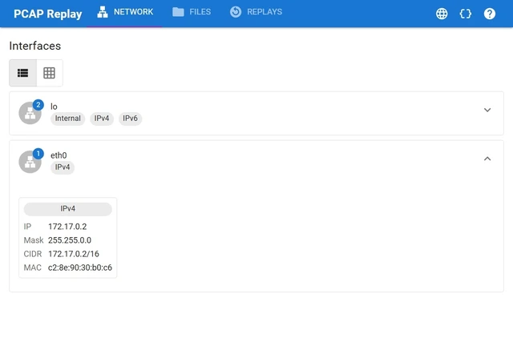
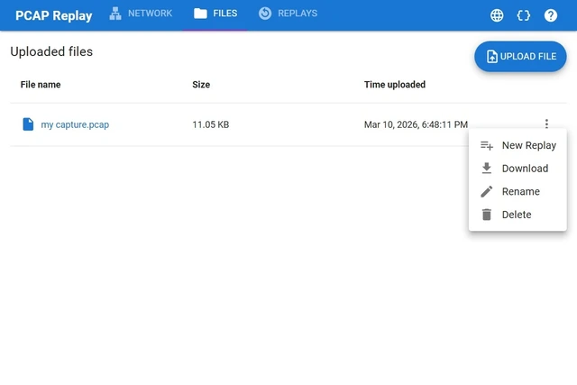
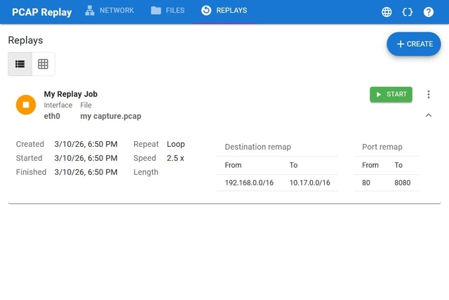
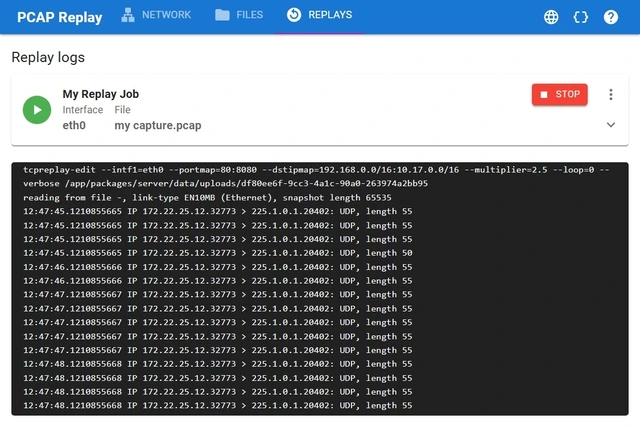

# PCAP REPLAY

Tool app to replay PCAP files inside a docker network.

---

## Features

- Uses [tcpreplay](https://tcpreplay.appneta.com/wiki/tcpreplay-edit-man.html) as a backend.
- Configure looping, speed, port remapping, address remapping, etc...
- Allows to upload and remotely manage the capture files.
- Create and reuse replay job settings.
- Stream job logs live.
- Embedded database for easy of deployment.

## Screenshots

**Network Page**: Lists the available network interfaces and their properties.



**Files Page**: Upload and manage files in the server, which can be used to create replay jobs.



**Replays Dashboard**: Inspect and manage replay jobs with advanced settings.



**Logs Watcher**: Observe real time logs from the replay jobs.



## Build & Run

To build the container image:

```bash
docker build . -t pcap-replay:latest
```

To run the image:

```bash
docker volume create pcap-replay-data
docker run \
    -p 3000:3000 \
    -v pcap-replay-data:/app/packages/server/data \
    --cap-add=NET_ADMIN \
    --cap-add=NET_RAW \
    pcap-replay:latest
```

## Troubleshooting

If you get permission errors running `tcpreplay-edit`,
such as `socket: Operation not permitted`,
give it permission for `CAP_NET_RAW`:

```bash
sudo setcap cap_net_raw,cap_net_admin=eip $(which tcpreplay-edit)
```
